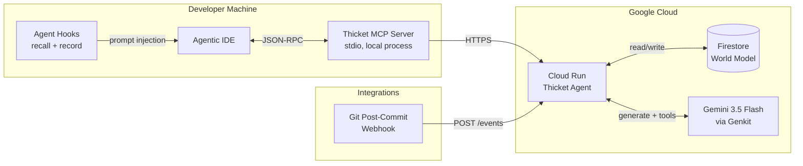
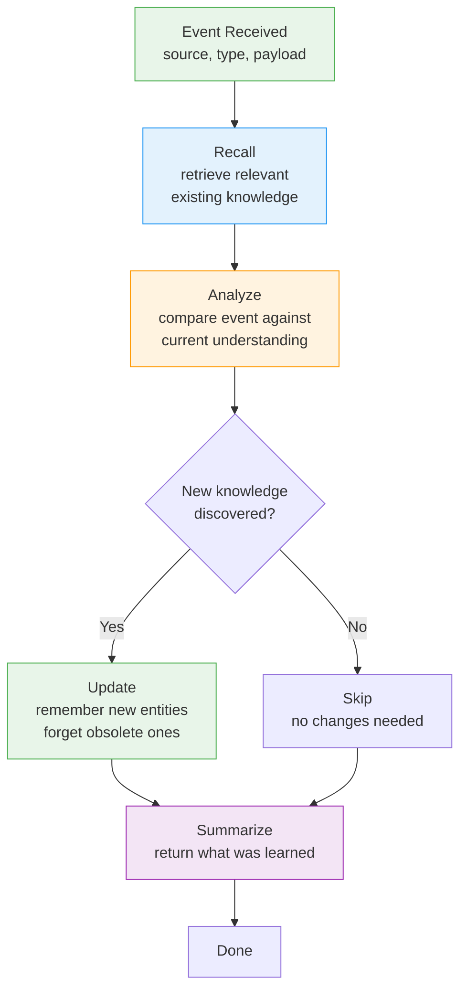
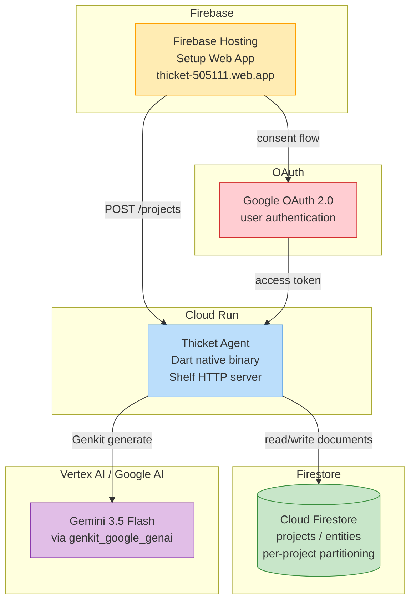
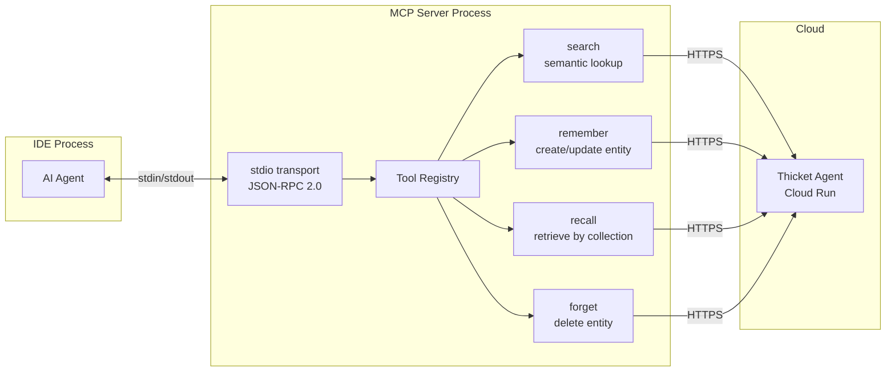
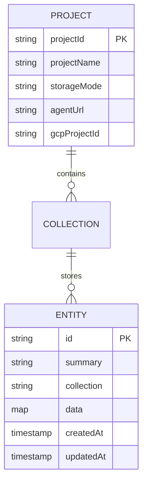
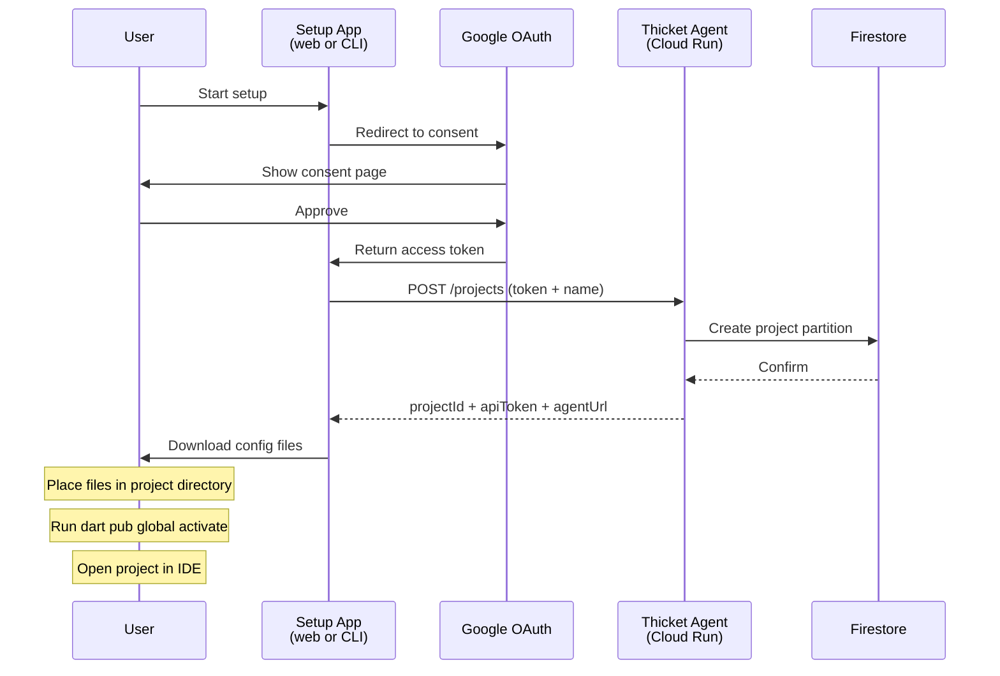

# Architecture

This document contains Mermaid diagram sources for Thicket's architecture at multiple levels of detail. 

## 1. System Overview

The end-to-end flow from a developer's IDE to the persistent world model.

**Flow:**

1. The IDE's AI agent triggers hooks (recall before responding, record after tasks).
2. The MCP server translates tool calls into HTTPS requests to the Thicket Agent on Cloud Run.
3. The Agent uses Genkit + Gemini 3.5 Flash to reason about events and decide what to store.
4. Knowledge is persisted as entities in Firestore, scoped per project.
5. External integrations (e.g., git post-commit hooks) send events directly to Cloud Run.

## 2. Agent Cognitive Loop

How the Thicket Agent processes an event and updates the world model.

The agent has up to 20 tool-calling turns per event, allowing it to iteratively recall, reason, and update in a single processing cycle.

## 3. Google Cloud Infrastructure

The specific GCP services and how they connect.

**Services used:**

| Service | Purpose |
|---------|---------|
| Cloud Run | Hosts the Thicket Agent (event processor + registration API) |
| Firestore | Persistent storage for the world model (entities, relationships, observations) |
| Gemini 3.5 Flash | Reasoning engine for event analysis and knowledge extraction |
| Firebase Hosting | Serves the setup web application |
| Google OAuth 2.0 | Authenticates users during project registration |
| Genkit | Orchestrates LLM calls with tool-use loops |

## 4. MCP Server (Interface Layer)

How the local MCP server bridges the IDE and the cloud.

The MCP server exposes four tools to the IDE's AI agent:

| Tool | Description |
|------|-------------|
| `search` | Semantic search across the world model using embeddings |
| `remember` | Store or update an entity in a named collection |
| `recall` | Retrieve all entities from a collection (or one by ID) |
| `forget` | Delete an entity that is no longer relevant |

## 5. World Model Data Structure

How knowledge is organized in Firestore.

The agent defines its own schema per project. Common collections include:

- `architecture` — system structure, component relationships
- `conventions` — coding patterns and style decisions
- `decisions` — rationale behind significant choices
- `gotchas` — failure modes, constraints, things to watch for
- `schema` — meta-record describing the world model's current structure

## 6. Setup Flow

How a new user goes from zero to a working Thicket integration.

