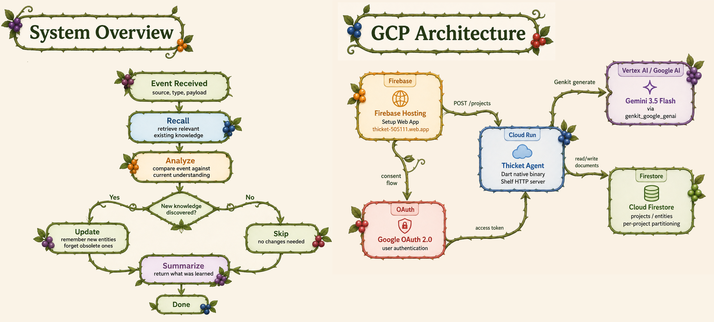

# Thicket

**Thicket is an architecture for long-lived AI agents that continuously learn from the environments in which they operate.**

<p align="center">
  
</p>

Most AI agents are transient. They receive a task, gather context, produce a result, and then discard much of what they learned. When they return to the same project later, they often spend additional inference reconstructing information they have already encountered.

Thicket gives agents a persistent **world model** that stores and structures knowledge accumulated over time. Instead of repeatedly rebuilding context from raw artifacts, an agent can retrieve its existing understanding, update it as new information arrives, and use that accumulated experience during future work.

The goal is an agent that does not merely complete tasks autonomously, but becomes increasingly experienced in the environment where it works.

## Core Idea

A Thicket agent operates continuously rather than only inside a chat loop.

It can observe events, retrieve relevant prior knowledge, reason about how new information changes its understanding, investigate gaps or contradictions, and update its world model.

For example, a software engineering agent might learn from:

* source code and commits;
* issues and pull requests;
* specifications and documentation;
* meeting transcripts and team discussions;
* test failures and incidents.

Over time, the agent might develop an understanding of project architecture, historical decisions, dependencies, conventions, failure modes, and unresolved questions.

Future tasks can then begin from accumulated experience instead of starting from scratch.

## Architecture

Thicket is organized into three independent layers.

```text
┌──────────────────────────────────────┐
│          Agent / LLM Layer           │
│                                      │
│ Observe • reason • investigate • act │
│                                      │
│ Repositories • Docs • Messages       │
│ Meetings • Tasks • APIs • Events     │
└──────────────────┬───────────────────┘
                   │
                   ▼
┌──────────────────────────────────────┐
│           Interface Layer            │
│                                      │
│ MCP • REST • SDKs • integrations     │
└──────────────────┬───────────────────┘
                   │
                   ▼
┌──────────────────────────────────────┐
│           World Model Layer          │
│                                      │
│ Entities • relationships • ontology  │
│ observations • provenance • history  │
└──────────────────────────────────────┘
```

<p align="center">
  
</p>

### World Model

The world model stores the agent's accumulated understanding.

Rather than acting only as a collection of memories, it represents entities and relationships within the environment. A software engineering world model might contain concepts such as:

```text
Project
Subsystem
Decision
Requirement
Dependency
FailureMode
Constraint
Incident
```

Thicket also supports agent-defined ontologies, allowing the agent to introduce new concepts and relationships when its existing representation is insufficient.

### Interface Layer

The interface layer exposes world-model operations without coupling agents to a particular storage implementation.

The current implementation uses an MCP server, but other interfaces such as REST APIs, SDKs, or direct integrations can be added independently.

### Agent / LLM Layer

The agent layer connects the world model to the outside world.

It observes information from connected systems, decides what matters, retrieves relevant knowledge, and updates the world model as its understanding changes.

The agent may also investigate missing information or ask questions when it identifies an important knowledge gap.

## Why Persistent World Models?

Large context windows and retrieval systems can provide access to information, but they still often require agents to repeatedly reconstruct what that information means.

Thicket explores a different approach: convert useful experience into a durable, structured representation that can be reused later.

This may improve more than continuity. If an agent can retrieve a compact representation of knowledge it previously derived from large amounts of raw context, it may require fewer tokens, fewer tool calls, and less time to complete future tasks at the same quality.

## More Than Memory

Thicket is not intended to be an append-only memory store.

A useful world model may need to:

* generalize repeated observations;
* represent relationships;
* preserve provenance;
* revise outdated beliefs;
* identify uncertainty;
* resolve contradictions;
* forget information that is no longer useful;
* create new abstractions.

The goal is not simply to help an agent remember more.

It is to help the agent build a better representation of its environment through experience.

## Example Use Cases

Thicket is designed for environments where an agent repeatedly works within the same evolving domain.

An engineering agent in a software project could learn architecture and historical decisions. A research agent could track concepts, evidence, and competing hypotheses. An operational agent could accumulate knowledge about incidents and remediation strategies. An organizational agent could learn from documents, meetings, messages, and project artifacts.

The underlying architecture remains the same even though the resulting world models may look very different.

## Reproducible Testing

Thicket is a hosted platform. You do not need your own GCP project, Gemini API key, or Firestore database. All backend infrastructure runs on the Thicket Cloud Run service. Setup takes roughly two minutes.

### Prerequisites

- A Google account (for OAuth sign-in).
- An agentic IDE with MCP support (e.g., Antigravity IDE).
- The [Dart SDK](https://dart.dev/get-dart) (required to run the Thicket MCP server locally).

### Option A: Web Setup

The fastest path. No installs required beyond a browser.

1. Visit [thicket-505111.web.app](https://thicket-505111.web.app).
2. Click **Sign in with Google** and authorize the application.
3. Enter a project name (e.g., `hackathon-test`) and click **Create project**.
4. Select the IDE you will be using.
5. Click **Download All (ZIP)** to get your configuration files.
6. Unzip the archive into the root of any project directory you want Thicket to learn about.
7. Activate the Thicket MCP server on your machine:
   ```bash
   dart pub global activate --source git https://github.com/Toglefritz/Thicket.git --git-path interface
   ```
8. Open the project in your IDE. The MCP server and agent hooks are now configured.

After setup, your AI agent will automatically search the Thicket world model for relevant knowledge before responding, and record useful discoveries after completing tasks.

### Option B: CLI Setup

A terminal-based wizard that performs the same steps and writes all files directly to your project.

1. Clone this repository and navigate to the CLI tool:
   ```bash
   git clone https://github.com/Toglefritz/Thicket.git
   cd Thicket/setup_cli
   dart pub get
   ```
2. Set your OAuth credentials and run:
   ```bash
   export GOOGLE_OAUTH_CLIENT_ID=1081534978416-r154ltgn28e9gq4qgsctbsdvntrvhuro.apps.googleusercontent.com
   export GOOGLE_OAUTH_CLIENT_SECRET=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
   dart run bin/setup_cli.dart
   ```
3. Follow the interactive prompts:
   - Your browser opens for Google sign-in.
   - Enter the path to your target project directory.
   - Provide a project name.
   - Select your IDE (Antigravity or Kiro).
4. The CLI writes all configuration files, installs the MCP server, and sets up agent hooks automatically.

### Verifying It Works

Once setup is complete (via either method):

1. Open your configured project in your IDE.
2. Start a conversation with the AI agent and ask it something about the project (e.g., "What is the architecture of this project?").
3. The agent should mention that it searched the Thicket world model (it may find nothing yet on a fresh project — that is expected).
4. Ask the agent to perform a task (e.g., "Add a comment explaining the main function").
5. After the task completes, the agent should reflect on whether it learned anything worth recording.

Over time and repeated sessions, the world model accumulates knowledge that future sessions can draw from.

### What Gets Created

After setup, your project directory will contain:

```
your-project/
  .thicket/
    project.json          # Project metadata (safe to commit)
    credentials.json      # API token (gitignored)
  .kiro/                  # (if Kiro was selected)
    settings/mcp.json     # MCP server configuration
    hooks/
      thicket-recall.json # Searches world model before responding
      thicket-record.json # Records knowledge after tasks
  .agents/                # (if Antigravity was selected)
    mcp_config.json       # MCP server configuration
    hooks.json            # Hook definitions
    scripts/
      thicket_recall.sh   # Recall hook script
      thicket_record.sh   # Record hook script
```
