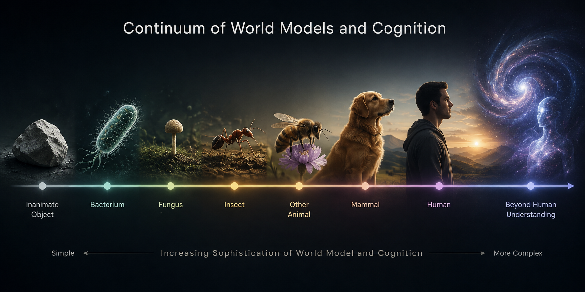

# The Story Behind Thicket
## A Spectrum of World Models

Picture a stone. A normal, small rock. Almost everybody would agree that a stone is not conscious. Most people probably do not interrogate this view much but, if they did, they would likely conclude something along the following lines: a stone is not conscious because it does not accept sensory input from the world nor take actions to affect the world. Stones are inanimate objects. They sit at one end of a spectrum.

<figure>
  
  <figcaption><i>Just an ordinary, inanimate stone</i></figcaption>
</figure>

Now picture a bacterium. Unlike a stone, a bacterium _does_ accept sensory input from the world. It also performs actions that affect the world. Anybody who has ever been sick from a pathogenic bacterium knows that bacteria can have fairly profound impacts on the larger world. But most people would still not say a bacterium is conscious. While it accepts inputs and produces outputs, bacteria do not "learn" in any way that we humans normally recognize. A bacterium is like an input/output machine, with the logic encoded in its DNA.

<figure>
  
  <figcaption><i>A bacterium, which does have a very simple world model</i></figcaption>
</figure>

Taking a step up the ladder of cognition, imagine a dog. Dogs also accept sensory inputs and take actions that affect the world. But, unlike bacteria, dogs are capable of learning. What does this mean exactly? Dogs are capable of adjusting the relationship between inputs and outputs based on their life experiences. A dog, like a bacterium, is born with certain behaviors encoded in its DNA. But a dog is not born being housetrained. It does not instinctively know to relieve itself only outside. However, through the experience of training, a dog can adjust its behavior. It updates its internal model of how the world works and how it should respond.

Now consider humans. Everyone would agree that humans are certainly conscious, if for no other reason than because humans invented the word "conscious" and defined ourselves as fitting the criteria. But, more than that, humans have an extremely sophisticated way of learning compared to most other animals. Humans have the profound ability to experience a simulated world in our minds. We can imagine future scenarios and practice our responses to those scenarios entirely within our own cognition. More than that, these imagined experiences actually affect our interactions with the real world. They change the way sensory inputs result in actions. Humans are capable of a kind of recursive self-learning: we can learn from experiences we have not yet had.

## The Continuum

If we take all of these examples together, we can see that there exists a spectrum where a system's "world model" becomes more and more sophisticated as we move along it. An inanimate object, like a stone, sits at one end. On the other end is some kind of super-being with a form of intelligence or consciousness that is the stuff of science fiction.

<figure>
  
  <figcaption><i>World model sophistication exists on a continuum</i></figcaption>
</figure>

A bacterium has a very simple world model that is essentially encoded in DNA. Many animals, such as dogs, have a more sophisticated model that is capable of adapting over time based on lived experience. Humans have a very sophisticated world model that is capable of recursive self-improvement and self-interrogation. Humans probably sit on the more sophisticated side of this spectrum compared to all other animals we have ever discovered.

The interesting observation is that each step along this continuum brings new capabilities. It is not just "more" of the same thing. It is qualitatively different behavior emerging from increasingly sophisticated internal representations of the world.

## Where Do Machines Fit?

This brings us to a critical question. What about machines?

Imagine an HVAC thermostat. It accepts input from the world using sensors, such as a thermometer. It takes actions on the world by changing the state of the HVAC system via electrical signals. Does it have a world model? One could argue that it does. A thermostat's world model comes from its programming rather than its DNA, but from a systems design perspective, this is simply an implementation detail. The thermostat has an internal representation (a target temperature, a current reading, a threshold for action) and it uses that representation to select outputs based on inputs. It sits at roughly the same position on the spectrum as a bacterium: reactive, but not adaptive.

<figure>
  
  <figcaption><i>In a way, a thermostat also has a world model</i></figcaption>
</figure>

Current LLMs are farther along this spectrum than thermostats, just as dogs are farther along than bacteria. LLMs accept input from the world and produce output. These inputs and outputs do not only exist in a virtual sense, which is a common objection to this line of reasoning. LLMs run on physical machines in the physical world. Those machines physically change their state. Electrical current physically flows. Transistors physically change position. The computation is real and physical, not hypothetical.

## Beyond Labels

The term "conscious" is fraught and not of particular importance for this project. It is just a label that humans invented to describe certain levels of sophistication in the world models held by different systems. Different people will use the term to describe potentially very different points along the continuum. Some would place the threshold at bacteria. Some at dogs. Some insist it requires human-level recursive self-awareness. The disagreement is about where to draw an arbitrary line, not about the existence of the spectrum itself.

Ultimately, the interesting question is not about when to apply certain adjectives to different systems. The interesting question is about the new capabilities that systems develop at different points along this continuum. What can a system with an adaptive world model do that a system with a fixed one cannot? What can a system with a self-improving world model do that a merely adaptive one cannot?

## Thicket's Place on the Spectrum

Current AI coding agents sit in an unusual position on this continuum. Within a single session, they exhibit sophisticated reasoning. They can inspect a codebase, form hypotheses, test approaches, and revise their understanding in real time. But across sessions, all of that accumulated understanding disappears. Each new session starts from zero. The agent is capable of learning within a session, but incapable of retaining that learning across sessions.

This is analogous to an animal that can learn during a single day but loses all of its learned behaviors every night. It would be intelligent moment to moment, but unable to develop the kind of deep, experience-based understanding that comes from months or years of interaction with the same environment.

Thicket is designed to move AI coding agents further along the world model continuum. It provides the infrastructure for agents to develop and maintain persistent world models that evolve with exposure to new experiences. It allows them to remember what they have learned, form beliefs about the systems they work with, and refine the conceptual structures they use to organize that knowledge.

The goal is not to make a philosophical claim about consciousness or sentience. It is to ask a practical engineering question: what new capabilities emerge when an AI agent can maintain and improve a persistent model of the world it operates in? And can those capabilities bring the agent closer to the kind of deep project understanding that experienced human engineers develop over time?

Thicket is an infrastructure for answering that question.
